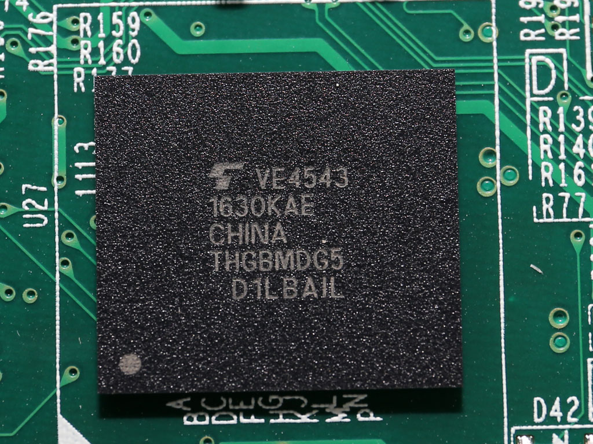

# Installing Ubuntu

The TS-453Be NAS boots from a [4GB eMMC](https://www.techpowerup.com/review/qnap-ts453b/4.html) soldered to the main board. Different methods can be used to install Ubuntu on the NAS:
- on the DOM, like done on the [TS-459 Pro](https://jorgbosman.nl/QNAP_TS-459_Pro_with_Ubuntu)
- on the disks, and chainload Ubuntu grub from the DOM grub
- on the disks, after modifying the DOM `grub.cfg` and copying the Ubuntu kernel and initrd to QNAP partitions

Unfortunately, it is not possible to permanently boot the NAS from an USB drive to change nothing.



Note: if the installation goes wrong the DOM can be easily restored using the following instructions https://wiki.qnap.com/wiki/Firmware_Recovery

This tutorial uses the third method to keep DOM modifications as small as possible. In a nutshell, it consists in:
1. a regular Ubuntu installation on SATA disks
2. copying kernel & initrd files to the DOM (after removing the original QTS ones)
3. editing `grub.cfg` on the DOM & reboot


## Steps

First, install Ubuntu on the SATA disks:
1. create a bootable Ubuntu USB drive
2. boot with Ubuntu on the USB front port
3. press F7 to select the USB drive
4. install Ubuntu server on the SATA disks

Then, copy files to the DOM:
1. mount `/dev/mmcblk1p2` as `/boot/qnap/`
2. move the `/boot/qnap/boot/bzImage` and `/boot/qnap/boot/initrd.boot` out of the DOM
3. copy the current Ubuntu kernel and initrd files (for example `/boot/vmlinuz-4.18.0-25-generic` and `/boot/initrd.img-4.18.0-25-generic`) to `/boot/qnap/boot/bzImage` and `/boot/qnap/boot/initrd.boot`
4. umount `/boot/qnap`

Finally, modify the DOM `grub.cfg`:
1. mount `/dev/mmcblk1p1` as `/media/mmcblk1p1/`
2. edit `/media/mmcblk1p1/grub/grub.cfg`
3. modify the `DOM kernel X86` entry such as:
```
menuentry 'DOM kernel X86' --class ubuntu --class gnu-linux --class gnu --class os {
        insmod ext2
        search --set=root --label QTS_BOOT_PART2
        # Use the blkid command to identify your disk UUID
        linux   /boot/bzImage root=UUID=17aef8e9-2807-1980-af39-6ac544fcb3af ro
        initrd  /boot/initrd.boot
}
```
3. modify the `DOM kernel X86 backup` entry to prevent QTS from reinstalling itself, such as:
```
menuentry 'DOM kernel X86 backup' --class ubuntu --class gnu-linux --class gnu --class os {
        insmod ext2
## Prevent QTS from booting ##
}
```
4. umount `/media/mmcblk1p1/`


## Some Useful Notes

### grubenv variables

Make sure that the DOM `grubenv` file contains these variables:
```
# grub-editenv grubenv list
saved_entry=0
prev_saved_entry=0
```

### Encrypted RAID1

Short notes to configure and encrypt a RAID1 volume:
- create a partition with type 0xFD
- `mdadm --create --verbose --level=mirror /dev/md1 --raid-devices=2 --force /dev/sda4 /dev/sdb4`
- `cryptsetup luksFormat /dev/md1`
- `cryptsetup luksOpen /dev/md1 data1 
- `mkfs.ext4 /dev/mapper/data1` 
- edit `/etc/crypttab` and the device and the key to use
- edit `/etc/fstab`

### Install UEFI on the Ubuntu Disk

Not necessary for this project

```
(parted) toggle 1 esp
(parted) p                                                                
Model: ATA WDC WD20EFRX-68E (scsi)
Disk /dev/sda: 2000GB
Sector size (logical/physical): 512B/4096B
Partition Table: msdos
Disk Flags: 

Number  Start   End    Size    Type     File system     Flags
 1      1049kB  200MB  199MB   primary  fat32           boot, esp
 2      200MB   300GB  300GB   primary  ext4
 3      300GB   308GB  8000MB  primary  linux-swap(v1)
```

See https://wiki.debian.org/GrubEFIReinstall
```
apt-get install --reinstall grub-efi
grub-install /dev/sda
```

### Edit an initrd File

```
xz -dc < ../initrd.boot | cpio --quiet -i --make-directories
# do some changes
find . 2> /dev/null | cpio --quiet -c -o | xz -9 --format=lzma > ../initrd_new.boot
cksum ../initrd_new.boot > ../initrd_new.boot.cksum
```
